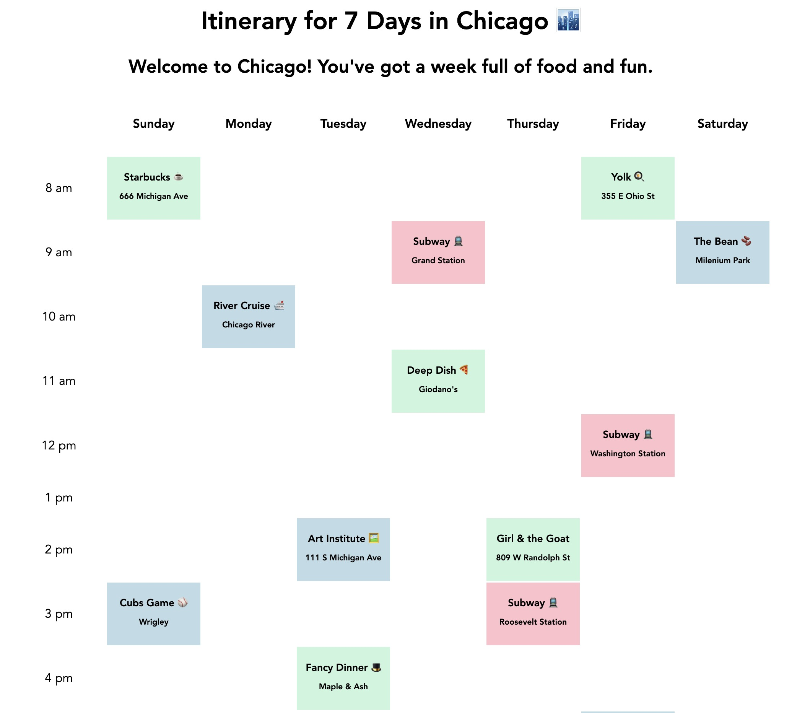

# 🗓️ TimeTabled - Simple Week Planner

**Timetabled** is a grid-style calendar built with React that maps out a one-week schedule with one-hour time blocks from 8 AM to 5 PM. Each event block is color-coded and personalized for a specific recipient—in this version, a fictional or real individual of your choice.

## 📸 Screenshot



## 🚀 Features

- One-week calendar view (Sunday through Saturday)
- One-hour time blocks from 8 AM to 5 PM
- Events with:
  - Titles
  - Color-coded types
- Event blocks include descriptions (like locations)
- Events dynamically use props to update UI

## 🛠️ Technologies Used

- **React**: Component-based UI
- **CSS**: Styling and layout
- **JSX**: React's templating syntax
- **Props**: Passed data between components (like event title, color, and location)

## 📁 Project Structure

```
src/
├── App.jsx
├── App.css
├── index.css
└── components/
  ├── Calendar.jsx
  └── Event.jsx
````

## 📝 How to Run

1. Clone the repository
2. Install dependencies: `npm install`
3. Start the dev server: `npm run dev`
4. View in browser at `http://localhost:5173`
